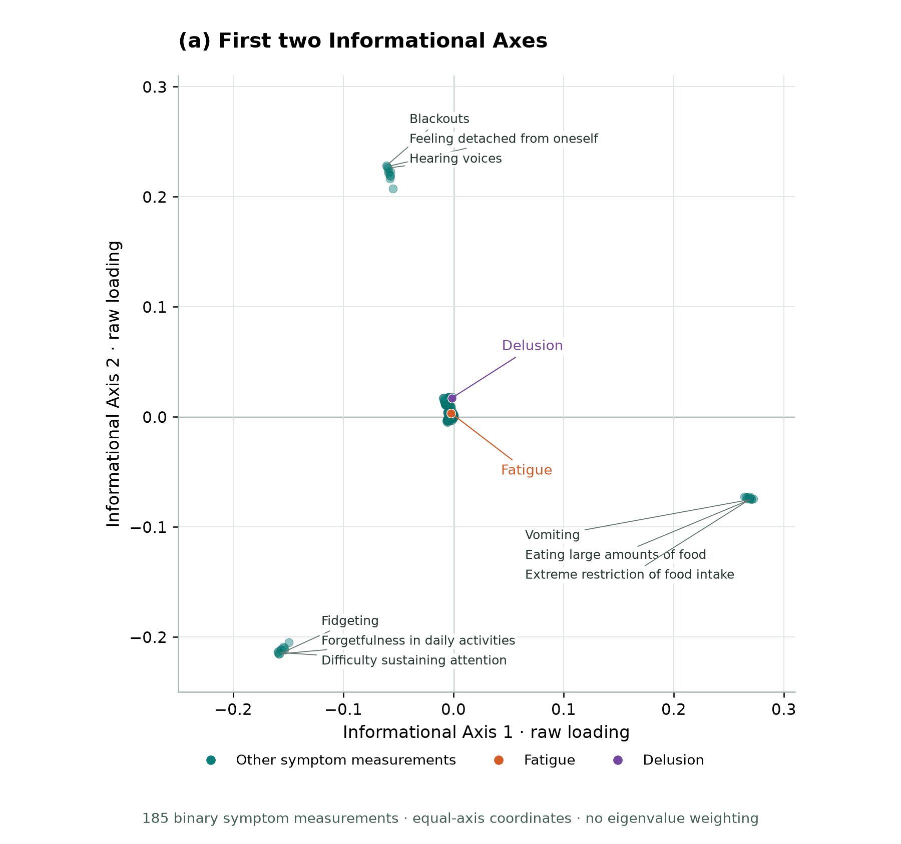
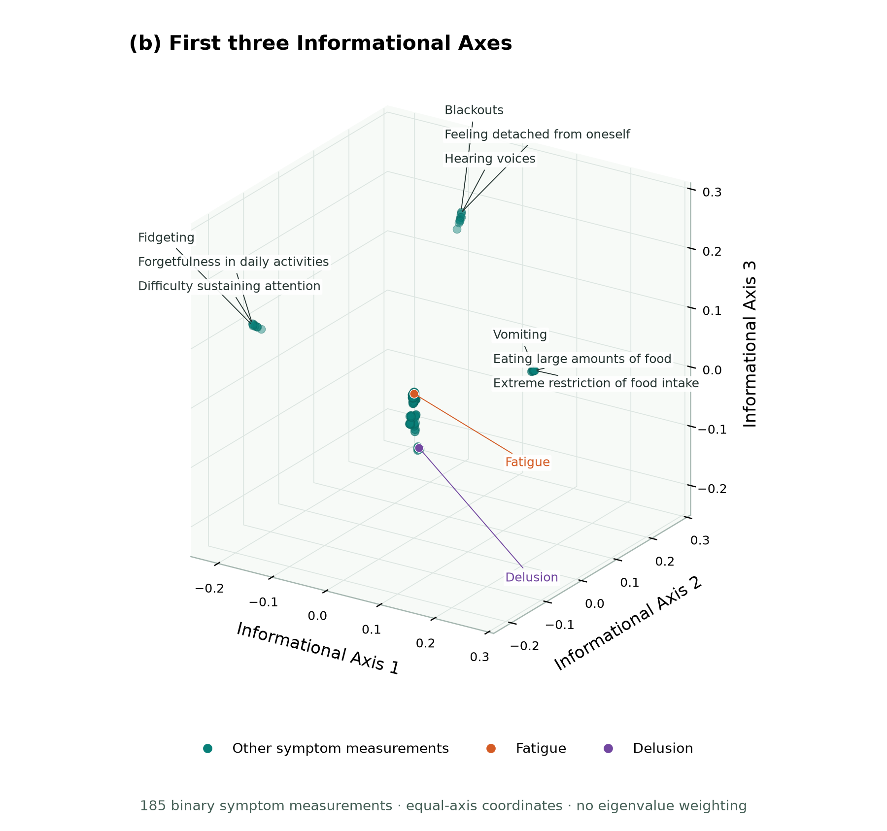

# The Entropic Scree
## Map the informational structure of your measurements

###### Initial Methods & Function Release: August 16, 2026 (Happy Birthday, Dad)

*[Terrence J. Lee-St. John, PhD](mailto:terry@enli.com.au)*  
*[Enli: Predictive systems that remain stable under change](https://www.enli.com.au)*

[](https://doi.org/10.5281/zenodo.22028086)
[](https://CRAN.R-project.org/package=Entropic.Scree)
[](https://github.com/tjleestjohn/Entropic-Scree/blob/main/LICENSE)

**[See the maps](#see-the-map) · [Install in R](#get-started-in-r)**

## What does Entropic Scree do?

A dataset can contain hundreds or thousands of measurements without representing hundreds or thousands of distinct underlying processes. The same process may appear through different symptoms, sensors, thresholds or combinations of measurements.

**Entropic Scree helps reveal how those measurements share information.** It compares their information relationships, organizes them into a map, and examines how much structure is concentrated in its leading directions.

Its outputs connect structural questions with practical uses:

- **Explore which measurements belong together.** Examine how survey items, symptoms, sensors or other features share information. Use the map to investigate unexpected groupings, overlapping measurements and complementary coverage before making decisions about measurement selection.
- **Choose a candidate size for a downstream model.** The scree plot recommends a primary rank and a broader region of weaker structure. The primary rank can guide the size of a nonlinear representation, such as an autoencoder bottleneck; that model still requires its own assessment of fit and generalization.
- **Understand shared structure in noisy data.** Informational volume summaries distinguish shared and idiosyncratic allocations. Average Informational Gravity (AIG) and Factor-Specific Informational Gravity (FSIG) describe the allocated shared footprint per primary axis. A small overall shared percentage can still correspond to a substantial footprint when many measurements express a compact structure.

**Each point in the map represents a measurement.** The map helps you understand what you measured before modeling individual observations. Its groupings support substantive investigation; they do not automatically identify latent causes or determine which variables should be removed.

## Why use it alongside established methods?

PCA is useful for summarizing linear variation. Entropic Scree addresses a different question: how do measurements share information when their relationships include nonlinear transformations, thresholds and categorical states? Comparing their selected dimensions can help investigate whether nonlinear expressions of shared processes require a much larger linear representation, and guide the choice of a downstream model.

| Common analytical challenge | What Entropic Scree adds |
|---|---|
| **Related measurements have little or no linear correlation.** | Mutual information can reveal pairwise dependence that covariance misses. |
| **The dataset mixes continuous and categorical measurements.** | Measurements are compared through probability relationships, avoiding arbitrary numerical distances between category labels. |
| **Nonlinear expressions of a few processes produce a large linear representation.** | The primary information spectrum offers a complementary dimensional diagnostic. |
| **Information-equivalent measurements move in opposite numerical directions.** | An information map can keep them together rather than separate them merely because their correlation is negative. |
| **One dominant direction obscures subtler group differences.** | An equal-axis map gives retained directions equal geometric weight, making secondary distinctions easier to examine. |
| **Distances between records are difficult to interpret in a high-dimensional mixed dataset.** | The method instead maps relationships between measurements, using their information across records. |

These advantages concern the representation being examined; they do not make Entropic Scree a universal replacement for PCA, clustering or predictive modeling. Its estimates still depend on sample size, data preparation and discretization. Relationships visible only jointly, with no pairwise dependence, can be missed.

In the paper's main synthetic experiment, the selected primary boundary matched the **20 generating variables**, while the evaluated PCA, rank-PCA and RBF Kernel PCA diagnostics selected differently or lacked a comparably resolved boundary. The primary selection remained 20 across three tested binning settings, although the gravity estimates changed substantially. These are results for the studied configurations, not a guarantee for every dataset.

## See the map

These examples use a [public synthetic mental-health symptom dataset](https://www.kaggle.com/datasets/sarveshchhetri/mental-health-symptom-dataset-one-hot-encoded): **8,304 records and 185 binary symptom measurements**. The disease label was excluded.

The analysis retained **20 primary Informational Axes**. The figures show only the first two and first three of those axes, using equal-axis coordinates. They therefore reveal parts of the structure, rather than the full 20-dimensional map.

### Two axes reveal distinct concentrations of measurements

<p align="center">
  
</p>

Measurements around **vomiting**, **fidgeting** and **blackouts** occupy distinct regions. Three labels in each outer group provide context, while many other measurements remain close together in the centre.

### A third axis reveals separation hidden in the first view

<p align="center">
  
</p>

Adding the third axis separates measurements that appeared close in 2D, including **fatigue** (orange) and **delusion** (purple). The same eleven measurements are labelled in both figures. Teal marks the other measurements; colours do not assign cluster membership.

This is the value of looking beyond individual pole summaries. Bipolar modules describe the two ends of each axis; the joint map lets you examine how measurements grouped together on one axis separate on another. Additional axes can reveal further distinctions. The examples illustrate measurement mapping in synthetic educational data, not clinically validated symptom groups.

The paper also describes an **eigenvalue-scaled view**, which preserves the relative spectral strength of the axes. The equal-axis view shown here emphasizes distinctions across the selected directions. The choice affects distances and visual emphasis, not the underlying eigendecomposition.

## What does the package provide?

| Output | What it helps you understand |
|---|---|
| **Entropic Scree plot** | How informational weight is distributed across axes and where spectral transitions occur. |
| **Primary rank recommendation** | A candidate number of primary informational directions to retain. |
| **Extended Signal Tail boundary** | How far the broader region included in shared-volume accounting extends. |
| **Bipolar modules and coefficients** | Which measurements anchor each end of an informational contrast. |
| **Informational volume summaries** | How the method allocates the retained measurement reference between shared and idiosyncratic structure. |
| **AIG and FSIG** | The shared-volume allocation per primary axis, on average and individually. |

The maps above visualize the numerical coordinates. The R package provides the numerical analysis and optional loading output; the figures were rendered separately. A full map needs coordinates for all retained measurements on the selected axes, not only the default subset of pole anchors. Automatic cluster membership requires an additional grouping rule.

Gravity and volume are the framework's spectral summaries. They are not direct estimates of the percentage of data values that are random error, nor proof that an axis is a distinct causal mechanism.

## Get started in R

The published implementation is **`Entropic.Scree` 1.0.1**, available on [CRAN](https://CRAN.R-project.org/package=Entropic.Scree).

```r
install.packages("Entropic.Scree")

library(Entropic.Scree)
library(data.table)

# Observations in rows; measurements in columns.
dt <- as.data.table(your_dataset)

results <- Entropic.Scree(
  dt,
  interactive_mode = TRUE,
  extract_bipolar_modules = TRUE
)

results$K_roots         # Selected primary rank
results$K_extended      # Extended signal boundary
results$AIG             # Average informational gravity
results$FSIG_final      # Axis-specific gravity
results$bipolar_modules # Pole-defining measurements and coefficients
```

The interactive interface lets you inspect and revise the recommended boundaries. Use `interactive_mode = FALSE` for unattended execution. The companion `Update.Entropic.Scree()` updates rank-dependent summaries without repeating the information-matrix calculation or eigendecomposition.

**Before running:** prepare complete records and explicitly encode nominal measurements as factors or character columns. In version 1.0.1, `num_bins` must accommodate the number of states in each categorical column; increasing it also changes the resolution target for continuous measurements. Constant, duplicate, low-entropy and optional collinearity checks can affect which measurements are retained.

See the [reference manual](https://stat.ethz.ch/CRAN/web/packages/Entropic.Scree/refman/Entropic.Scree.html) for preparation options, arguments and returned fields. Large numbers of measurements can require substantial memory and computation because the method constructs and decomposes a dense pairwise matrix.

## Python package — coming soon

A native Python package is in development. Installation instructions and a PyPI link will be added when it is released. The published R package is available now through CRAN.

## Methods and reproducible experiments

For the mathematical definitions, mapping geometry, interpretation limits and experiments, read the [preprint](https://doi.org/10.5281/zenodo.22028086):

**The Entropic Scree: An Information-Theoretic Mapping Framework for Estimating Intrinsic Rank and Informational Gravity in Tabular Systems.**

The paper's main experiments use a historical embedded **1.0.0 beta** implementation. The paper explains its differences from CRAN 1.0.1. Use these pinned scripts to examine that experimental implementation:

- [Main simulation](https://github.com/tjleestjohn/Entropic-Scree/blob/064dcbd1401633c16669fe3d9826c6b37a9fe2d8/Entropic.Scree.R.Simulation%20-%20ENLI.R)
- [Binning-ablation companion](https://github.com/tjleestjohn/Entropic-Scree/blob/064dcbd1401633c16669fe3d9826c6b37a9fe2d8/Appendix.B.Binning.Ablation.R)

Inspect the main script before running it in a dedicated R session: it clears the workspace, installs dependencies and compiles its embedded C++ backend. The full experiment is computationally demanding. The ablation runs afterward in the same session and reuses the generated data and baseline result.

## Cite the work

```bibtex
@misc{leestjohn2026entropic-scree,
  author    = {Lee-St. John, Terrence J.},
  title     = {The Entropic Scree: An Information-Theoretic Mapping Framework for Estimating Intrinsic Rank and Informational Gravity in Tabular Systems},
  year      = {2026},
  publisher = {Zenodo},
  doi       = {10.5281/zenodo.22028086},
  url       = {https://doi.org/10.5281/zenodo.22028086}
}
```

For the software citation, run `citation("Entropic.Scree")` in R. The package DOI is [10.32614/CRAN.package.Entropic.Scree](https://doi.org/10.32614/CRAN.package.Entropic.Scree).

## Related resources

- [Entropic Scree preprint](https://doi.org/10.5281/zenodo.22028086)
- [From Garbage to Gold (G2G) preprint](https://arxiv.org/abs/2603.12288)
- [G2G simulation repository](https://github.com/tjleestjohn/from-garbage-to-gold)
- [Enli](https://www.enli.com.au)
- [Contact Terrence](mailto:terry@enli.com.au)

Distributed under the [Apache License 2.0](https://github.com/tjleestjohn/Entropic-Scree/blob/main/LICENSE).
